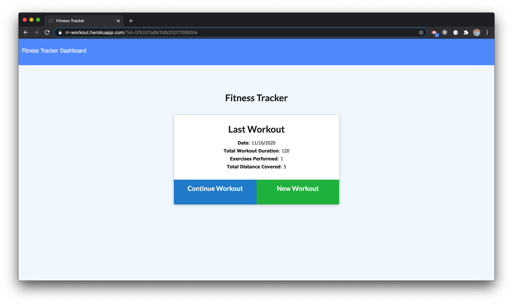
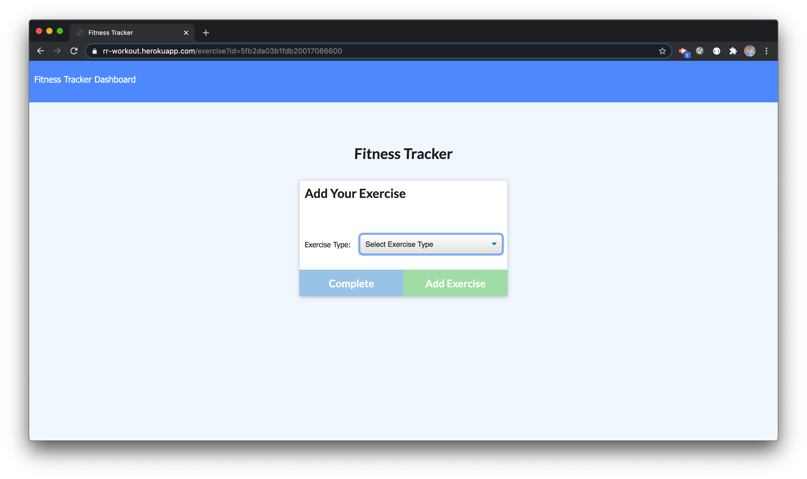
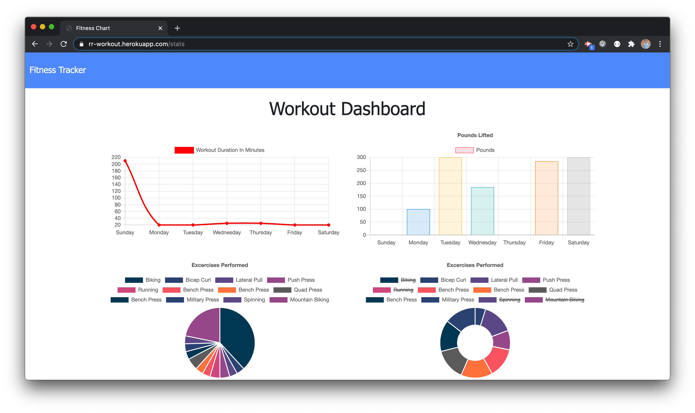

# Homework 17: Workout Tracker

## Description
This repository holds the homework assignment for Week 17 of the [The Coding Boot Camp](https://techbootcamps.utexas.edu/coding/) through the University of Texas at Austin's Center for Professional Education.

The scope of this project is to create a workout tracker with MongoDB, Mongoose, Express, and Heroku. This application will allow a user to track their workouts and exercises done on a given day. The application launches showing you the details of the last workout. The user has the option to either continue the workout or add a new workout. If the user chooses to continue the workout, they are presented with the screen to add the details of a new exercise and when submitted that exercise will be added to the current workout. If the user chooses to add a new workout, the application will create a brand new workout and present the user with the inputs to add a new exercise to the newly created workout. Finally the application has a dashboard where the user can visually track their workouts and exercises via two different graphs that show their workout duration and pounds lifted.

## Notes
This application uses the following Node.js packages:
- [express](https://expressjs.com/)
- [mongoose](https://www.npmjs.com/package/mongoose)
- [morgan](https://www.npmjs.com/package/morgan)
- [path](https://nodejs.org/dist/latest-v14.x/docs/api/path.html)

## Instructions
This project is deployed on Heroku [here](https://rr-workout.herokuapp.com).

## Page Screenshots

## Contributing
Any and all collaboration is welcome so if you have any suggestions or thoughts for new features, please send me an email at ryan.rotman@gmail.com.